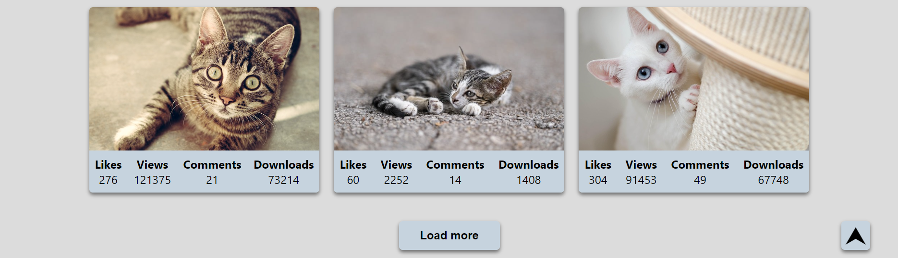

# [PicFinder](https://stanislavzhuk.github.io/PicFinder/)

PicFinder is an online service for searching and viewing various images on any topic.

## Features

### Explore and Search

- Explore a wide range of images, including photographs, illustrations, graphics, and more, on PicFinder.
- Just click on the card to expand the photo and see the details in a larger size.

### Explore and Search

- The 'Load More' button allows you to load more images without reloading the page.
- The 'To Top' button allows you to easily return to the top of the page with one click.

## Technologies

## Contact Us

If you have any questions, suggestions, or need assistance, feel free to contact our support team at stanislavzhuk.dev@gmail.com.